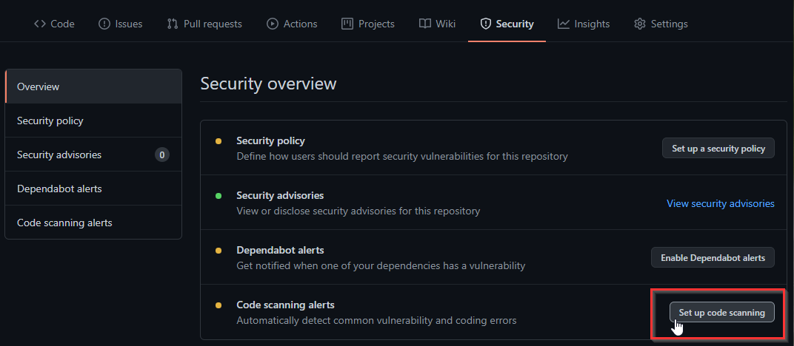
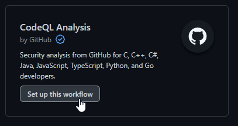
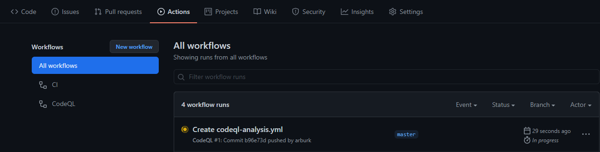
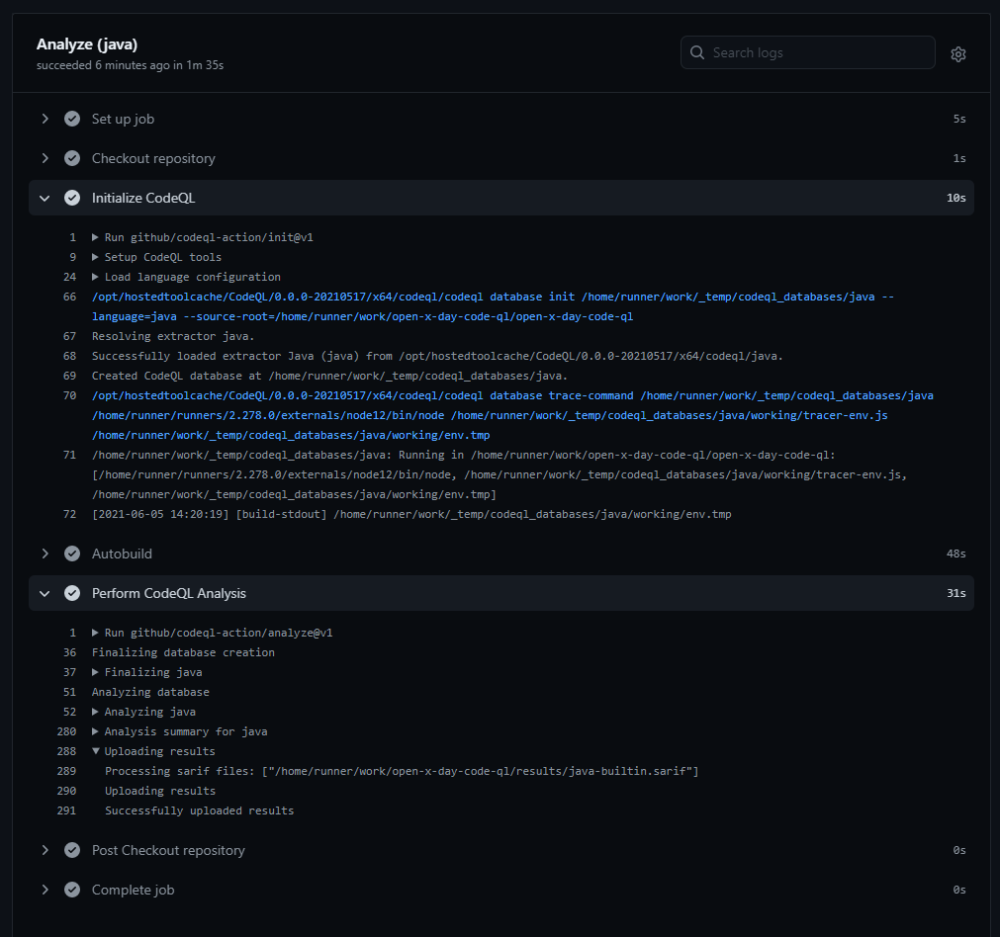
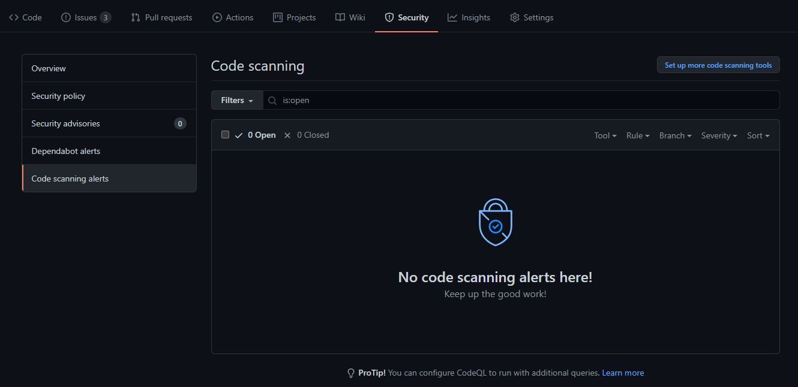
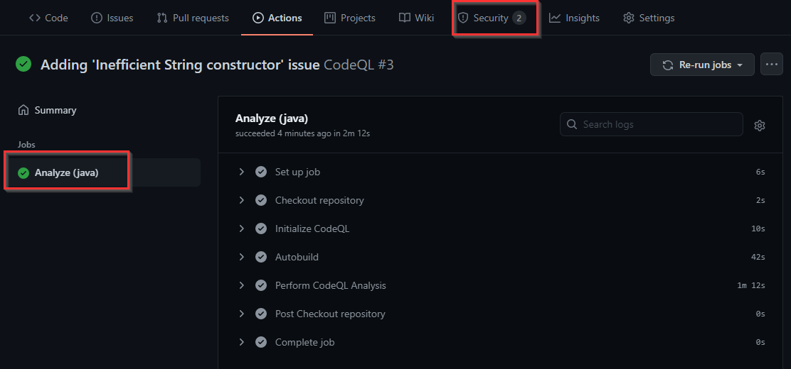
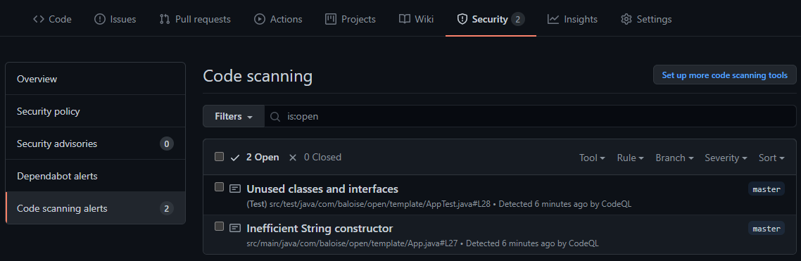
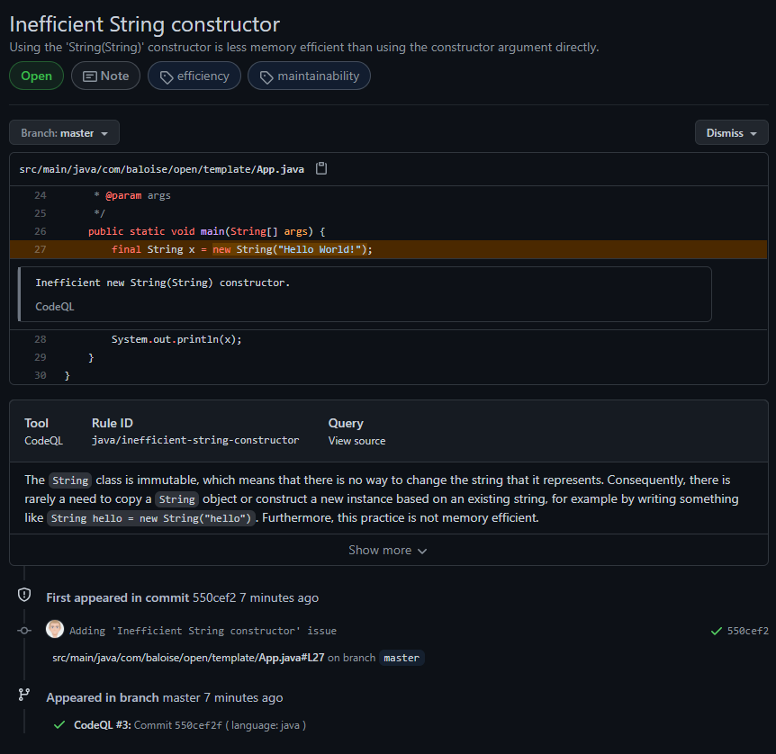
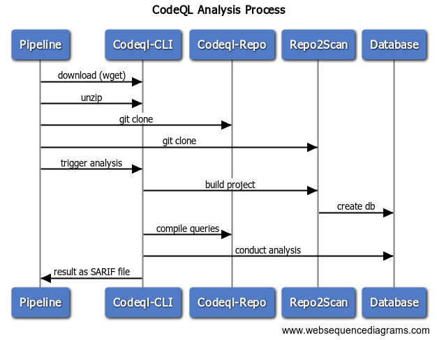

# Agenda
1. [Motivation](#Motivation)
1. [What is CodeQL](#Top1)
2. [Differentiation to Sonarcloud/Sonarqube](#Top2)
3. [Integrated usage in Github](#Top3)
4. [How to use in different CI-evn (e.g. Jenkins)](#Top4)
5. [Conclusion](#Top5)


# <a id="Motivation"></a> Motivation
- Github [announced](https://github.blog/2020-09-30-code-scanning-is-now-available/) availability of "new" code scanning feature end of Q3/2020
  > GitHub code scanning is a developer-first, GitHub-native approach to easily find security vulnerabilities before they reach production. We’re thrilled to announce the general availability of code scanning. You can enable it on your public repository today!
- Curious about this feature (capabilities, how it works etc.)
- I'm used to working with Sonarqube and appreciate that service


# <a id="Top1"></a> What is [CodeQL][CodeQL]
> A ___semantic code analysis engine___, which lets you query code as though it were data.
>> CodeQL helps you explore code quickly to find and eradicate all variants of vulnerabilities before they become a problem.
>> By automating variant analysis, CodeQL enables product security teams to find zero-days and variants of critical vulnerabilities
- Available for C, C++, C#, Go, Java, JavaScript and Python
- It is based on [SemmleCode](https://semmle.com/), which is an object-oriented query language for deductive databases developed by Semmle.
- Semmle Inc itself is a code-analysis platform provider, that was acquired by Github (i.e., Microsoft) on 18 September 2019

### How does it work
- It creates a ___relational representations___ of your source code (i.e., database).
- That database can be queried like any other
  using queries written in a specially-designed, object-oriented [query language][CodeQL] in order to identify likely bugs,
  metrics, performance issues, language abuse ... or any other '__bad__' pattern
  (e.g., [Inefficient String constructor](https://github.com/github/codeql/blob/main/java/ql/src/Performance/NewStringString.ql))
- multiple queries are grouped into [CodeQL Suites][CodeQL Suites]
- [Tutorial][Find the thief] to learn the query language
- Results in JSON formatted [SARIF][SARIF] file, according to [Azure][SARIF Azure]:
  > The Static Analysis Results Interchange Format (SARIF) is an industry standard format for the output of static analysis tools.

# <a id="Top2"></a> Differentiation to Sonarcloud/Sonarqube
- possibility to write and execute own queries
- seamless integration in Github but also in VS-Code and  
- executable on developer machine using [CLI][CodeQL CLI binaries] (Linux, Windows and OSX)

# <a id="Top3"></a>Integrated Usage in Github
1. add new Github Action via security tab
   
2. select 'CodeQL Analysis'
   
3. adjust and commit new [action](.github/workflows/codeql-analysis.yml)
4. verify action is running
   
5. Review results
   
   
   

## Demo adding issue to show how its notified
- change App.java to
  ```
  final String x = new String("Hello World!");
  System.out.println(x);
  ```
- ensure query is executed by adjusting config to use suite __security-and-quality__ 
  is currently executing 166 checks (instead of default 31 security relevant checks)
  
  - specify additional config file
    ```
    - name: Initialize CodeQL
        uses: github/codeql-action/init@v1
        with:
          languages: ${{ matrix.language }}
          config-file: ./.github/codeql-config.yml
    ```
  - containing the proper suite to be considered for code analysis
    ```
    name: "My custom config"
    queries:
      - uses: security-and-quality
    ```
  
- action is succeeding although issues were identified


___

___



# <a id="Top4"></a>How to use in own CI (e.g. Jenkins@Baloise)

1. Using CLI in jenkins pipeline
   
    1.1. ```sh "wget https://github.com/github/codeql-cli-binaries/releases/download/v2.5.5/codeql-linux64.zip"```
   
    1.2. ```sh "unzip -n -u codeql-cli-binaries-2.5.2-linux64.zip"```

2. Get queries by cloning CodeQL repo
  
    ```sh "git clone --depth=1 https://github.com/github/codeql.git codeql-repo"```

3. Get repo to be analyzed
  
    ```git clone --depth=1 https://github.com/baloise-incubator/codeql2sonar-maven-plugin.git project2scan```
  
4. Create database to be scanned
    
    ```sh "./codeql-cli/codeql database create ./project2scan/codeql_database --language=java --source-root=./project2scan/ --command='mvn clean package -f pom.xml -B -V -e -Dfindbugs.skip -Dcheckstyle.skip -Dpmd.skip=true -Denforcer.skip -Dmaven.javadoc.skip -DskipTests -Dmaven.test.skip.exec -Dlicense.skip=true -Drat.skip=true'"```

5. Conduct analysis

    ```sh './codeql-cli/codeql database analyze ./project2scan/codeql_database --format=sarif-latest --output=./project2scan/java-analysis.sarif  --no-sarif-add-snippets ./codeql-repo/java/ql/src/codeql-suites/java-security-and-quality.qls --no-metadata-verification'```

#### Demo: [Example pipeline setup for MF-Admin](https://ci.balgroupit.com/view/MF/job/motorfahrzeug/job/mfadminServer/job/CodeQL/configure)

- Approach works from technical perspective
- There are some tradeoffs compared to usage in Github, mainly the user experience
  - Performance (i.e., execution time)
    - Can be optimized by using preconfigured container using precompiled queries
    - Reduce execution by time focusing on steps 3. to 5.
      
  - Identification of issues
    - while perfectly displayed in Github the developer has to read large json files
    - Sonarqube/Sonarcloud provides an ["Generic Issue Import"](https://docs.sonarqube.org/latest/analysis/generic-issue/)
    - A [codeql2sonar-maven-plugin][codeql2sonar-maven-plugin] has been developed to convert the codeQL generated SARIF file to that generic format   
    - Thus the results can be integrated in Sonarqube/Sonarcloud and displayed the common used way


# <a id="Top5"></a>5. Conclusion
- CodeQL is a powerful mechanism to improve code quality
  - driven by Microsoft/Github
  - large community participation ([compare pulse](https://github.com/github/codeql/pulse/monthly))
- It is not a replacement for static code analysis but a complement to it
  - Important to know: some files are not (yet) scanned (e.g. lomboked classes)
- Supports relevant technology stack  
- Enables to conduct scans for own queries
  - Steep learning curve getting known to the query language itself


[CodeQL]: https://securitylab.github.com/tools/codeql/
[CodeQL references]: https://codeql.github.com/docs/codeql-overview/
[CodeQL Queries]: https://github.com/github/codeql/
[CodeQL Suites]: https://github.com/github/codeql/tree/main/java/ql/src/codeql-suites
[CodeQL CLI binaries]: https://github.com/github/codeql-cli-binaries
[LGTM Query console]: https://lgtm.com/query/rule:1823453799/lang:java/
[Find the thief]: https://codeql.github.com/docs/writing-codeql-queries/find-the-thief/
[SARIF]: http://docs.oasis-open.org/sarif/sarif/v2.0/csprd01/sarif-v2.0-csprd01.html
[SARIF Azure]: https://sarifweb.azurewebsites.net/
[codeql2sonar-maven-plugin]: https://github.com/baloise-incubator/codeql2sonar-maven-plugin